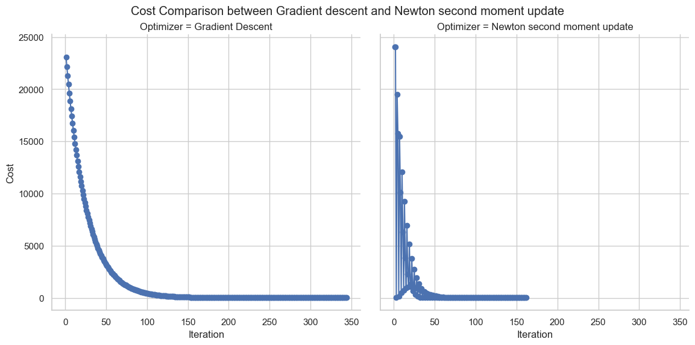

# Conclusion

## Iteration Insight

Throughout the experiment in various test scenarios, the optimum cost and iteration cost to reach convergence varied significantly, leading to unexpected conclusions.

## Optimization Results

### Normal Init

| Algorithm            | Iteration | Cost   | Early Stopping |
| -------------------- | --------- | ------ | -------------- |
| Newton Moment Update | 171       | 6.9812 | Yes            |
| Gradient Descent     | 164       | 6.9564 | Yes            |

Newton Moment Update: Iteration stopped early at 171 due to low cost difference.
Gradient Descent: Iteration stopped early at 164 due to low cost difference.

**Conclusion:**
The optimum values reached in both variants are strikingly similar, with Gradient Descent marginally outperforming Newton Momentum Update by a very small margin. The close convergence of both optimization methods suggests that for the given dataset and hyperparameters, the choice between these methods may not significantly impact the final outcome. It's important to note that the performance comparison may vary based on the specific characteristics of the dataset and the problem at hand. The local optimal value was converged early on in the case of Newton optimization.

### Best Init

| Algorithm            | Iteration | Cost   | Early Stopping |
| -------------------- | --------- | ------ | -------------- |
| Gradient Descent     | 173       | 6.9674 | Yes            |
| Newton Moment Update | 98        | 6.9327 | Yes            |

Newton Moment Update: Iteration stopped early at 98 due to low cost difference.
Gradient Descent: Iteration stopped early at 173 due to low cost difference.

**Conclusion:**
A well-thought-out optimization value works phenomenally well for Newton moment optimization, demonstrating that better initialization can make the optimal value converge faster and with better precision.

### Worst Init

| Algorithm            | Iteration | Cost   | Early Stopping |
| -------------------- | --------- | ------ | -------------- |
| Gradient Descent     | 344       | 6.9559 | Yes            |
| Newton Moment Update | 162       | 6.9361 | Yes            |

Newton Moment Update: Iteration stopped early at 162 due to low cost difference.
Gradient Descent: Iteration stopped early at 344 due to low cost difference.

**Conclusion:**
This striking difference in performance reveals the nature of Newton second moment itself. As this optimization leverages the information of the Hessian and curvature landscape information of values, the performance enhances, and also the use of the momentum factor makes the early updation possible. JAX optimization nature for Autodiff also plays a vital role in this performance, as it can handle stable complex differentiation scenarios well.

## Final Conclusion - TLDR of Experiment

In this experiment, we observed that Newton Second Moment (Newton Momentum) outperformed Gradient Descent in most scenarios. This superior performance can be attributed to several factors:

1. Stable Autodiff Nature of JAX: Newton's method benefits from a stable autodifferentiation process, making it more robust in capturing higher-order derivatives. This stability allows Newton to converge faster and more reliably compared to Gradient Descent.

2. Leveraging Nature of Curvature: Newton's method leverages information about the curvature of the cost function. This allows it to adapt more effectively to the landscape of the optimization problem, making larger updates in regions with less curvature and smaller updates in regions with higher curvature.

3. Hessian Updation Through Random Matrix Operation: The use of random matrix operations in updating the Hessian matrix contributes to the effectiveness of Newton Second Moment. This introduces variability in the updates, aiding in escaping local minima and exploring the solution space more effectively.

4. Less Dependence on Hyperparameters: Newton Second Moment exhibits less sensitivity to hyperparameters, such as learning rate, compared to traditional Gradient Descent. This is because Newton's method computes the optimal step size based on the Hessian matrix, providing more intrinsic adaptability.

5. Use of Second Moment Order Information for Stability: Incorporating second-moment order information in the optimization process enhances stability. The use of the Hessian matrix and its inverse in Newton's method contributes to the stability of the optimization updates.

However, one major disadvantage of Newton Second Moment is its complexity and dependence on optimal weight and bias initialization. The method requires a well-tailored initialization to avoid divergence or slow convergence, making it less user-friendly and potentially challenging in practical applications.

In summary, Newton Second Moment's superior performance stems from its stable autodiff nature, effective leverage of curvature information, random matrix operations, and reduced sensitivity to hyperparameters. Nevertheless, its complexity and dependence on optimal initialization are key considerations in its application.
